# Code Structure / Architecture

Next.js 16 App-Router monolith: UI → server actions → domain services → two LangGraph
orchestrators → Prisma/Postgres, plus side-car integrations (RAG/Pinecone, LLM gateway)
and an experimental MCP server.

**Legend:** solid = built today · dotted (`stroke-dasharray`) = planned / stubbed / ghost feature.

```mermaid
flowchart TB
    subgraph UI["🖥️ UI Layer — app/ + components/"]
        Auth["(auth)/login · signup"]
        PatientUI["(app)/patient — onboarding · dashboard"]
        AdminUI["(app)/admin — dashboard · patient detail · graph-config"]
        ChatUI["(app)/chat — ephemeral assistant"]
        Guards["guards/ Auth · Onboarding · Role"]
        Cards["ui/ cards: Exercise · Nutrition · Symptoms · Sleep"]
        Renderer["DashboardRenderer (type→card)"]
        Registry["COMPONENT_REGISTRY / ROUTE_MAP<br/>dynamic module routing"]
        Provenance["'physician edited' badge"]
    end

    subgraph EDGE["🔌 Server Actions & API Routes"]
        Actions["lib/actions.ts — authenticatedAction()"]
        ChatAPI["/api/chat (streamText, no persist)"]
        IngestAPI["/api/ingest (PDF→Pinecone)"]
        AuthAPI["/api/auth (NextAuth v5)"]
        GraphCfgAPI["/api/admin/graph-config"]
    end

    subgraph SVC["⚙️ Domain Services — lib/"]
        UserSvc["user/ biometrics·baseline·profile"]
        StateSvc["state/ State·Module·Progress (Zod)"]
        ExtSvc["external/ compileExternal (loop boundary)"]
        OnbSvc["onboarding/ questioning·baselines·profile"]
        RagSvc["rag/ Pinecone hybrid + rerank"]
        LlmSvc["llm/ gateway(modelId)"]
        AuthUtils["auth-utils requireRole/patientAccess"]
    end

    subgraph GRAPH["🧠 LangGraph"]
        OnbGraph["onboarding graph — PostgresSaver, interrupt/resume"]
        StateGraph["state-generation — one-shot, Send fan-out"]
        MoreModules["+ symptoms/sleep module nodes"]
        ChatGraph["chat_agent_graph"]
        DocGraph["doctor_review_graph"]
    end

    subgraph DATA["💾 Data & External"]
        Prisma[("Postgres / Prisma 7")]
        Pinecone[("Pinecone + OpenAI embeddings")]
        Gateway["Vercel AI Gateway → Claude / deepseek"]
    end

    subgraph MCP["🤝 MCP Server (ghost feature)"]
        McpTools["tools/ patient·planning·rag·context"]
    end

    subgraph INFRA["☁️ Hosting"]
        Vercel["Vercel (today)"]
        CF["Cloudflare Workers + Hyperdrive"]
    end

    PatientUI --> Guards --> Actions
    AdminUI --> Actions
    ChatUI --> ChatAPI
    PatientUI --> Renderer --> Cards
    Registry -.-> Renderer
    Provenance -.-> Cards

    Actions --> UserSvc & StateSvc & ExtSvc & OnbSvc & AuthUtils
    ChatAPI --> RagSvc & LlmSvc
    StateSvc --> StateGraph
    OnbSvc --> OnbGraph
    StateGraph --> ExtSvc & LlmSvc
    StateGraph -.-> MoreModules
    OnbGraph --> LlmSvc & UserSvc
    ChatAPI -.-> ChatGraph
    AdminUI -.-> DocGraph

    UserSvc & StateSvc & ExtSvc & OnbSvc --> Prisma
    OnbGraph --> Prisma
    RagSvc --> Pinecone
    IngestAPI --> Pinecone
    LlmSvc --> Gateway

    McpTools -.-> SVC
    McpTools -.-> GRAPH
    Vercel -.->|migration| CF

    classDef planned stroke-dasharray:5 5,stroke:#999,fill:#f7f7f7,color:#555;
    class Registry,Provenance,MoreModules,ChatGraph,DocGraph,CF,MCP,McpTools planned;
```

## Built vs planned

- **Built today:** full UI→actions→services→Prisma path, both LangGraph graphs, RAG,
  standalone chat route, MCP server with 4 tool groups, admin/role guards.
- **Planned (dotted):** `COMPONENT_REGISTRY`/`ROUTE_MAP` dynamic dashboard routing
  (commented in `components/recovery/registry.ts`), symptoms/sleep as first-class LLM
  modules, `chat_agent_graph` + `doctor_review_graph`, MCP↔service/graph wiring (ghost
  feature), and the Cloudflare migration.
